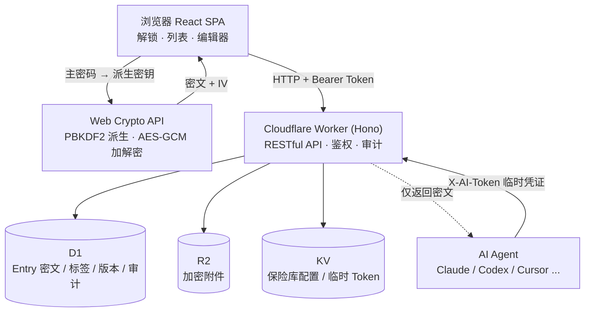
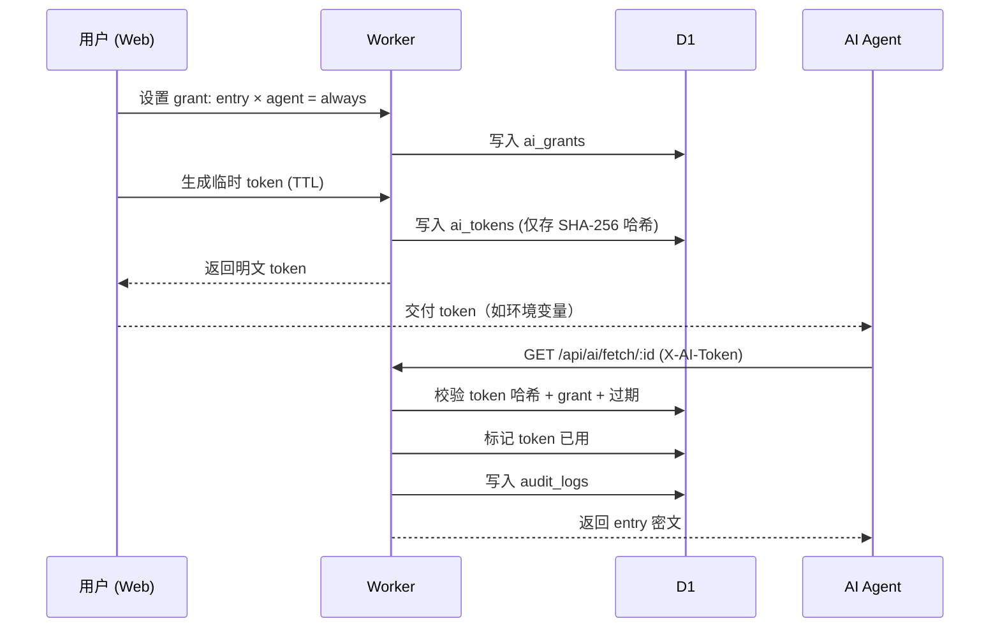

# 架构设计

## 总体架构

## 数据流：加密写入

1. 用户在编辑器输入字段值
2. 浏览器用内存中的主密钥（`session.key()`）调用 `encryptContent()` → AES-GCM 加密为 `{ciphertext, iv}`
3. 前端 `POST /api/entries`，body 仅含标题/类型/标签/密文/IV（**无明文**）
4. Worker 写入 D1，记录审计日志

## 数据流：解密读取

1. 前端 `GET /api/entries` 拿到密文列表
2. 选中 Entry → `decryptContent(session.key(), {ciphertext, iv})` → 还原明文字段
3. 搜索/筛选：标题与标签由服务器查询；正文搜索在浏览器本地完成（解密后）

## AI 访问流（第十五章）

## 分层职责

| 层 | 职责 | 不做的事 |
| --- | --- | --- |
| 浏览器 | 派生密钥 · 加解密正文 · UI · 本地搜索 | 不上传主密码 |
| Worker | CRUD 密文 · 鉴权 · 审计 · AI 授权校验 | 不解密、不存明文 |
| D1 | 持久化密文与元数据 | — |
| R2 | 持久化加密附件 | — |
| KV | 保险库配置（salt+verifier）· 临时 Token 缓存 | — |

## 路由与静态资源

- `/api/*` → Hono API（鉴权后访问绑定）
- 其余路径 → React SPA 静态资源（`wrangler.jsonc` 中 `not_found_handling: single-page-application`，由 `@cloudflare/vite-plugin` 托管）
