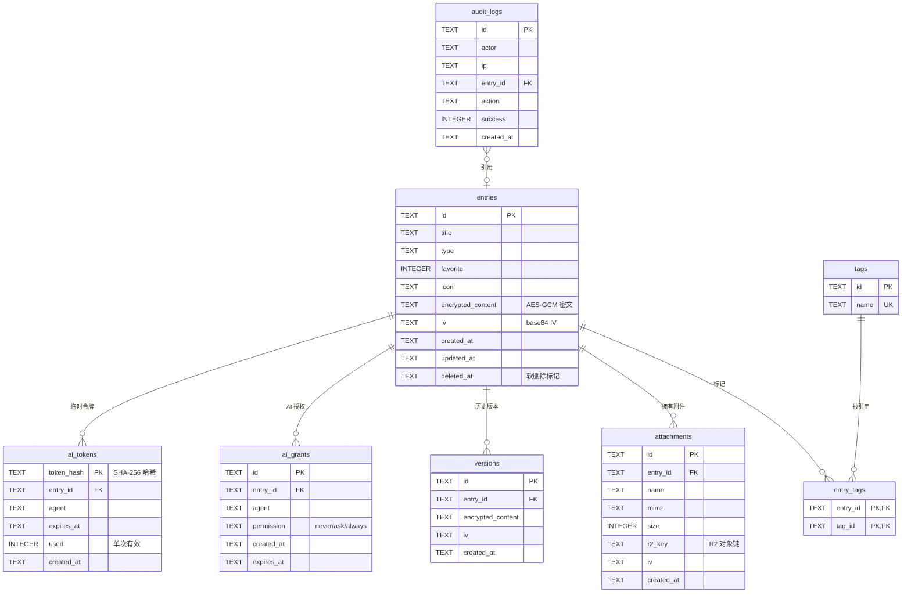

# 数据库 ER 图

对应 `migrations/0001_init.sql`。

## 表说明

| 表 | 用途 | 敏感字段处理 |
| --- | --- | --- |
| `entries` | 核心条目，统一 Entry 模型 | `encrypted_content` 为密文，`iv` 随每次更新变化 |
| `tags` / `entry_tags` | 无限标签，多对多关联 | 标签名非敏感 |
| `attachments` | 附件元数据 | 内容密文存 R2，`iv` 存表 |
| `versions` | 历史版本，每次更新自动保存 | 同样只存密文 |
| `audit_logs` | 访问审计 | — |
| `ai_grants` | 每个 Entry × Agent 的权限 | — |
| `ai_tokens` | 临时访问 Token | 只存 SHA-256 哈希，单次有效 |

## 关键索引

- `idx_entries_type` / `idx_entries_favorite`：按类型/收藏筛选（仅未删除）
- `idx_entries_updated`：最近排序
- `idx_entries_deleted`：回收站
- `idx_versions_entry`：按 Entry 取历史
- `idx_audit_created` / `idx_audit_entry`：审计查询
- `idx_ai_tokens_exp`：过期清理
